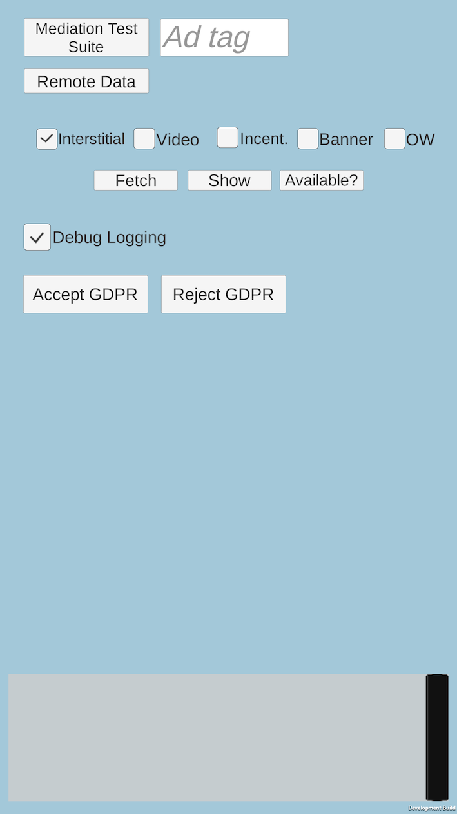

Heyzap Unity Example App
===============

This sample app demonstrates the basic functionalities of the Heyzap SDK for Unity (iOS and Android). 

### Features:
* You can fetch and show Interstitial, Video, Incentivized, and Banner ads from the main screen by selecting one of them and pressing the fetch and show buttons.
* All fetches and shows on the main screen will use the ad tag entered in the ad tag text field, or the default tag if no tag is entered.
* The Mediation Test Suite can be opened, which allows you to test ads and debug settings for each network.
* A console view prints callbacks and other information from the Heyzap SDK.
    * You can print the Remote JSON data you've set on your Heyzap dashboard to the console view.
* You can enable and disable debug logging from Heyzap.
* You can accept or reject the European General Data Protection Regulation (GDPR).
* You can set pre-set values for GDPR Consent data (see AdManager.cs to inspect pre-set values) 
* you can clear GDPR Consent Data.

### Setup

In order to utilize the test app with your own settings on your Heyzap dashboards, you'll need to change a couple of things:
* Your Bundle ID
    * Change the bundle identifier in the player settings (`File` -> `Build Settings` -> `Player settings...`) from `com.heyzap.unity.sampleapp` to your game's bundle ID.
* Your Publisher ID
    * Change the publisher ID string set in `AdManager.cs` from `ENTER_YOUR_PUBLISHER_ID_HERE` to your own publisher ID.

If you do not do these things, 3rd-party networks will not be available in the test app, since your third-party credentials will not be retrieved from Heyzap's servers.

### Mediated ad networks
The Heyzap SDK (`v9.8.0`) is already included. To use this sample app with other networks, follow the [instructions on our site](https://developers.heyzap.com/docs/unity_sdk_setup_and_requirements) to add other frameworks/libraries/jars.

To update the version of the Heyzap SDK in this project, you must first remove all traces of the Heyzap SDK from the project first by deleting the following directories:

* `Editor/Heyzap/`
* `Plugins/Heyzap/`
* `Plugins/Android/Heyzap/`
* `Plugins/iOS/Heyzap/`

Then, import the `.unitypackage` from the updated SDK.

The sample app requires Unity 5 to run.
